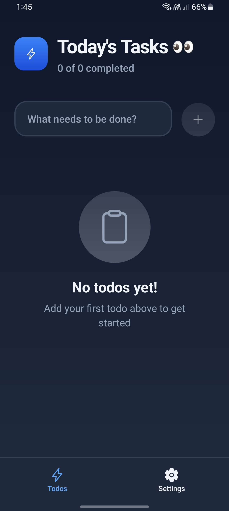
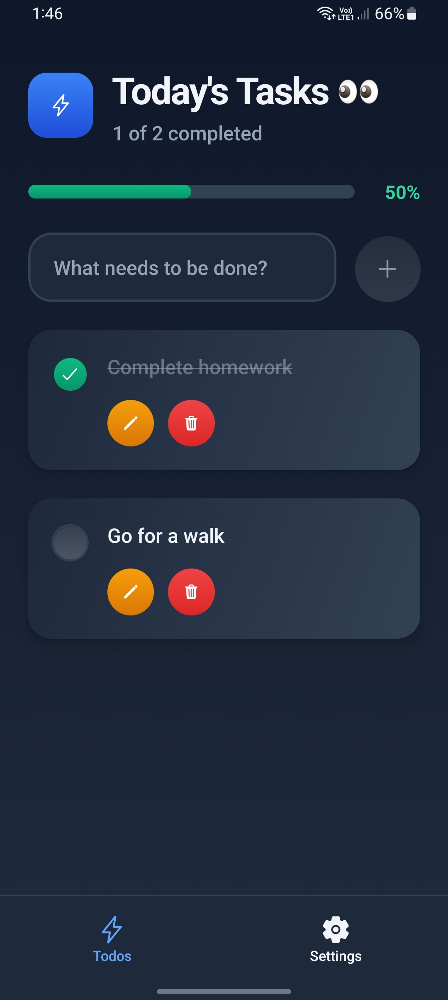
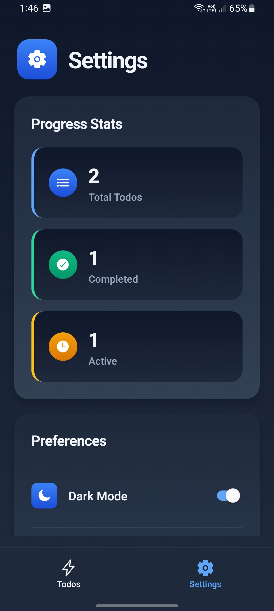
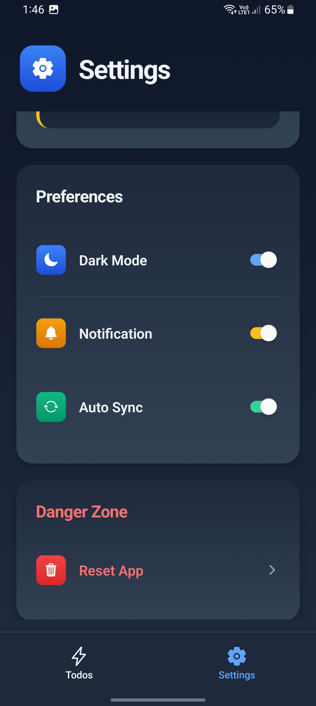

# ⚡️ Todo — React Native + Convex Todo App

A sleek and modern **Todo App** built with **Expo (React Native)** and **Convex** backend.
It helps you stay productive with smooth UI, persistent storage, progress tracking, and customizable preferences like **Dark Mode**, **Notifications**, and **Auto Sync**.

---

## 📱 Preview

### 🏠 Home Screens

<p align="center">
  
  
</p>

### ⚙️ Settings Screens

<p align="center">
  
  
</p>

---

## 🚀 Features

✅ **Add, Edit, and Delete Todos**
✅ **Mark tasks as completed**
✅ **Progress tracking (percentage and count)**
✅ **Persistent storage using Convex backend**
✅ **Dark Mode support**
✅ **Notification toggle**
✅ **Auto Sync toggle**
✅ **Reset App (Danger Zone)**
✅ **Smooth and responsive UI with Linear Gradients**

---

## 🧠 Tech Stack

| Layer          | Technology                                          |
| -------------- | --------------------------------------------------- |
| **Frontend**   | [Expo](https://expo.dev/), React Native, TypeScript |
| **Backend**    | [Convex](https://convex.dev)                        |
| **Storage**    | AsyncStorage (local) + Convex DB (remote)           |
| **UI Styling** | React Native + LinearGradient                       |
| **Icons**      | Ionicons                                            |

---

## ⚙️ Installation & Setup

### 1️⃣ Clone the Repository

```bash
git clone https://github.com/TheGauravsahu/todo-app.git
cd todo-app
```

### 2️⃣ Install Dependencies

```bash
npm install
# or
pnpm install
```

### 3️⃣ Set Up Convex

1. Go to [Convex.dev](https://convex.dev)
2. Create a new project
3. Copy your Convex deployment URL
4. Add it to your `.env` file:

   ```env
   EXPO_PUBLIC_CONVEX_URL=https://<your-convex-url>
   ```

### 4️⃣ Run the App

```bash
pnpm expo start
```

## 🌗 Settings Overview

- **Dark Mode** → Toggle app theme
- **Notification**
- **Auto Sync**
- **Reset App** → Clears all stored data

## 💙 Author

**Gaurav Sahu** |
🔗 [GitHub](https://github.com/TheGauravsahu)
